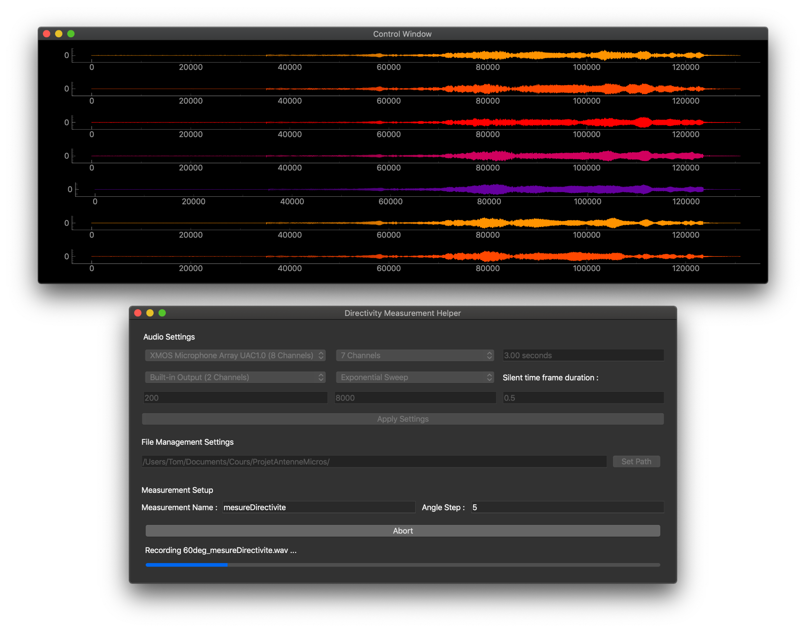

# adm - Acoustic Directivity Measurement
Fast acoustic directivity measurements Graphical User Interface. 



## Installation
Adm runs with Python 3.7 and depends on [PyQt5](https://pypi.org/project/PyQt5/), [pyqtgraph](http://www.pyqtgraph.org/), [numpy](https://www.numpy.org/), [pyaudio](https://pypi.org/project/PyAudio/), [serial](https://pypi.org/project/serial/) and [wave](https://docs.python.org/3/library/wave.html#module-wave). 

To install the libraries, clone this repository and in that directory execute:
```sh
python3 -m pip install -r requirements.txt
```


### Required Hardware
1. Arduino Uno
2. Turn Table

## About this project
Created by @Tomaubier and @DumasRaphael for a project at Le Mans University.

